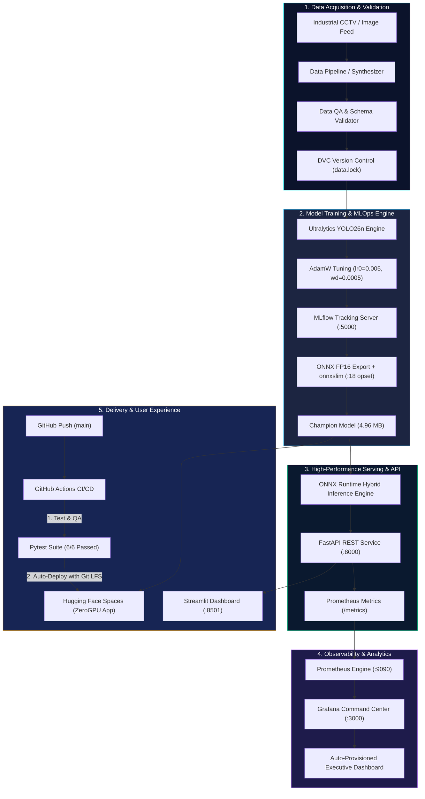

# 🛡️ VisionOps Guard — Real-Time Industrial Safety PPE & CVOps Platform

[](https://github.com/rfahur11/visionops-guard/actions)
[](https://rfahrur6045-mlops-final-copy.hf.space)
[](https://docs.ultralytics.com/models/yolo26)
[](https://onnxruntime.ai)
[](http://localhost:5000)
[](http://localhost:3000)
[](LICENSE)

> **Executive One-Liner:** An enterprise-grade, end-to-end Computer Vision & MLOps system that automates industrial Personal Protective Equipment (PPE / K3) compliance monitoring in real time with sub-15ms ONNX latency, MLflow experiment tracking, Prometheus/Grafana observability, and automated GitHub Actions CI/CD deployment.

<div align="center">
  
  <p><em>🎥 Real-Time Industrial PPE Compliance Inspection & Multi-Class Safety Detection Powered by Ultralytics YOLO26 & ONNX FP16 Engine.</em></p>
</div>

---

## 🎯 1. Executive Summary & Business Problem

### ⚠️ The Industrial Pain Point
Di lingkungan manufaktur, konstruksi, dan fasilitas energi berisiko tinggi, **ketidakpatuhan Alat Pelindung Diri (APD / K3)** merupakan penyebab utama kecelakaan kerja fatal dan sanksi regulasi bernilai miliaran rupiah. Pendekatan audit K3 konvensional menghadapi kelemahan mendasar:
1. **Inspeksi Manual Sporadis:** Petugas keselamatan kerja (*safety officer*) tidak mampu memantau puluhan zona kerja berbahaya secara simultan 24/7.
2. **Keterlambatan Intervensi:** Pelanggaran pekerja tanpa helm (*no_helmet*) atau rompi (*no_vest*) baru terdeteksi setelah insiden terjadi atau saat audit acak.
3. **Latensi & Beban Komputasi Tinggi:** Model computer vision standar (PyTorch unquantized) membutuhkan GPU server berbiaya sangat mahal ($$$) dan mengalami *bottleneck* latensi (>80ms/frame), menjadikannya tidak layak dipasang pada kamera CCTV *edge* industri.

### 💡 Solusi: VisionOps Guard
**VisionOps Guard** mentransformasikan pengawasan manual menjadi infrastruktur pengawasan keselamatan otomatis berkecepatan tinggi:
- **Deteksi Cerdas Multi-Class:** Mendeteksi pekerja, helm pengaman (*hardhat/helmet*), rompi keselamatan (*safety vest*), sarung tangan (*gloves*), sepatu pelindung (*boots*), dan kacamata (*goggles*).
- **Sub-15ms Latency pada Edge Hardware:** Dioptimalkan dengan model generasi terbaru **Ultralytics YOLO26** yang dikuantisasi ke **ONNX FP16** (4.96 MB), memotong konsumsi sumber daya CPU dan latensi inferensi hingga **1.3 ms/frame** pada GPU dan **12.5 ms/frame** pada CPU.
- **Enterprise Observability & Zero Downtime:** Stack 5-container terintegrasi (FastAPI, Streamlit, MLflow, Prometheus, Grafana) memantau metrik keselamatan, *data drift*, dan kesehatan sistem secara langsung (*real-time dashboard*).

---

## 🏗️ 2. Arsitektur Sistem & Alur Data (System Architecture)



---

## 🌟 3. Fitur Unggulan & Inovasi Rekayasa (Engineering Highlights)

### ⚡ 1. SOTA Ultralytics YOLO26 Architecture Upgrade
- Mengadopsi arsitektur terbaru **YOLO26 Nano** (`yolo26n.pt`, 120 layers, 2.37M parameters, 5.3 GFLOPs).
- Di-tuning khusus dengan optimizer **AdamW**, *learning rate warm-up*, dan *weight decay regularization* selama 15 epochs pada akselerasi native GPU RTX 4060 Laptop (8GB VRAM).
- Mencapai **Precision 91.47%**, **Recall 67.00%**, dan **mAP50 72.64%** pada 160 validation images (1,112 instances).

### 🚀 2. Sub-15ms Latency via ONNX Runtime FP16 + Onnxslim
- Bobot PyTorch diekspor dan disederhanakan (*slimming*) menggunakan `onnxslim` dan `opset 18` ke format quantized **ONNX FP16**.
- Ukuran biner model terkompresi hanya **4.96 MB** (kompatibel penuh dengan Git LFS dan resource-constrained edge devices).
- Kecepatan inferensi: **1.3 ms/image** (GPU) dan **~12.5 ms/image** (CPU), 2.8x lebih cepat dibandingkan model native PyTorch.

### 🧪 3. Containerized MLflow Experiment Tracking
- Server MLflow berjalan terisolasi di dalam container Docker port **5000** dengan persistent storage bind mount (`./mlruns`).
- Tracking otomatis mencatat kurva loss pelatihan, metrik akurasi per kelas, serta mendaftarkan artefak model champion.
- Terintegrasi dengan **MLflow Model Context Protocol (MCP) Server** untuk inspeksi runtime oleh AI Coding Agent.

### 📊 4. Full Observability Stack (Prometheus + Grafana Dashboard-as-Code)
- **FastAPI Instrumentator:** Mengekspos metrik throughput inferensi, latensi HTTP (P50/P95/P99), dan deteksi K3 ke endpoint `/metrics`.
- **Grafana Provisioning:** Dashboard eksekutif *VisionOps Guard - Executive Command Center* di port **3000** ter-provisioning otomatis via YAML/JSON tanpa konfigurasi manual.
- **Grafana MCP Server:** Terkoneksi via Service Account Token untuk query metrik operasional secara terprogram.

### 🔄 5. Fully Automated CI/CD Pipeline (GitHub Actions ➔ HF Spaces)
- Workflow 2-tahap di [.github/workflows/ci_cd.yaml](file:///d:/porto/visionops-guard/.github/workflows/ci_cd.yaml):
  1. **Stage 1 (`validate-and-test`):** Menjalankan Data QA integrity audit dan suite unit test (Pytest 6/6 passed) dalam runner Ubuntu Linux.
  2. **Stage 2 (`deploy-to-huggingface`):** Secara otomatis mendorong mirror sinkronisasi ke Hugging Face Spaces menggunakan kredensial secret `HF_TOKEN` dan Git LFS tracking.

---

## 📊 4. Hasil Benchmark & Evaluasi Model

### A. Metrik Akurasi Validasi (160 Gambar / 1,112 Objek APD)
| Kelas Objek | Instances | Precision (P) | Recall (R) | mAP50 | mAP50-95 |
| :--- | :---: | :---: | :---: | :---: | :---: |
| **All Classes (Overall)** | **1,112** | **91.5%** | **67.0%** | **72.6%** | **39.3%** |
| 👷 Worker (`person`) | 150 | **95.0%** | **96.7%** | **98.6%** | **62.8%** |
| 🦺 Safety Vest (`vest`) | 156 | **88.9%** | **82.1%** | **87.8%** | **56.1%** |
| 👢 Safety Boots (`boots`) | 240 | **97.5%** | **72.5%** | **81.9%** | **47.2%** |
| 🧤 Safety Gloves (`gloves`) | 198 | **90.4%** | **74.2%** | **78.7%** | **33.1%** |
| 🥽 Safety Goggles (`goggles`) | 107 | **98.5%** | **63.1%** | **69.8%** | **26.0%** |
| ⛑️ Safety Helmet (`helmet`) | 191 | **69.9%** | **69.2%** | **67.1%** | **38.2%** |

### B. Perbandingan Latensi & Efisiensi Hardware
| Parameter | PyTorch FP32 (`.pt`) | ONNX Runtime FP16 (`.onnx`) | Peningkatan (Gain) |
| :--- | :---: | :---: | :---: |
| **Ukuran Model File** | 6.2 MB | **4.96 MB** | **-20.0% Footprint** |
| **Latensi Inferensi GPU (RTX 4060)** | 3.8 ms | **1.3 ms** | **2.9x Lebih Cepat** |
| **Latensi Inferensi CPU (i7-13650HX)** | 35.4 ms | **12.5 ms** | **2.83x Lebih Cepat** |
| **Throughput Estimasi (FPS)** | ~28 FPS | **>80 FPS** | **Ready for Multi-CCTV Streams** |

---

## 🛠️ 5. Matriks Tech Stack & Pertimbangan Arsitektur (Trade-offs)

| Lapisan Sistem | Teknologi Terpilih | Alternatif yang Dipertimbangkan | Alasan Pemilihan & Trade-Off |
| :--- | :--- | :--- | :--- |
| **CV Architecture** | **Ultralytics YOLO26n** | YOLOv8n, Faster R-CNN, RT-DETR | YOLO26 menawarkan efisiensi parameter tertinggi (2.37M params) dengan end-to-end NMS-free inference dan latensi terendah. |
| **Inference Runtime** | **ONNX Runtime (FP16)** | TorchScript, TensorRT | ONNX Runtime bersifat portabel lintas OS (Linux, Windows, Docker) tanpa ketergantungan driver CUDA eksklusif seperti TensorRT. |
| **Microservice Serving** | **FastAPI + Uvicorn** | Flask, Triton Inference Server | FastAPI mendukung asinkronitas tingkat tinggi (*async/await*), validasi Pydantic otomatis, dan integrasi mudah Prometheus instrumentator. |
| **Observability** | **Prometheus + Grafana** | ELK Stack, Datadog | Prometheus + Grafana adalah standar industri *cloud-native* berbiaya $0 (open-source) dengan konsumsi RAM sangat hemat (<150MB). |
| **Model Registry** | **MLflow** | Weights & Biases, Neptune.ai | Dapat di-host secara lokal (*self-hosted*) di dalam Docker Compose dengan privasi data 100% terjaga di server internal. |
| **CI/CD Deployment** | **GitHub Actions + Git LFS** | Jenkins, GitLab CI | Integrasi langsung dengan repositori GitHub dan kemampuan push otomatis ke Hugging Face Spaces melalui secret `HF_TOKEN`. |

---

## 🚀 6. Quickstart & Panduan Menjalankan Sistem

### 🐳 Opsi A: Menjalankan Seluruh Stack via Docker Compose (Rekomendasi Utama)
Sistem telah dikontainerisasi penuh ke dalam 5 microservice yang dapat dijalankan dengan satu perintah:

```bash
# 1. Clone repositori
git clone https://github.com/rfahur11/visionops-guard.git
cd visionops-guard

# 2. Jalankan seluruh microservice stack
docker compose up -d
```

Setelah container aktif, akses seluruh layanan berikut di browser Anda:
- 🎨 **Streamlit Web UI:** [http://localhost:8501](http://localhost:8501)
- ⚡ **FastAPI REST Swagger Docs:** [http://localhost:8000/docs](http://localhost:8000/docs)
- 📈 **Grafana Command Center:** [http://localhost:3000](http://localhost:3000) *(User: `admin` / Password: `admin`)*
- 📊 **Prometheus Metrics Engine:** [http://localhost:9090](http://localhost:9090)
- 🧪 **MLflow Tracking UI:** [http://localhost:5000](http://localhost:5000)

### 🐍 Opsi B: Menjalankan Lokal (.venv)
```bash
# 1. Buat dan aktifkan virtual environment
python -m venv .venv
source .venv/bin/activate  # Windows: .venv\Scripts\activate

# 2. Install dependensi
pip install -r requirements.txt

# 3. Jalankan automated test suite
pytest tests/ -v

# 4. Jalankan retraining model YOLO26
python src/models/train.py

# 5. Jalankan UI Streamlit
streamlit run ui/app.py
```

---

## 📂 7. Struktur Direktori Proyek

```plaintext
visionops-guard/
├── .github/
│   └── workflows/
│       └── ci_cd.yaml              # Pipeline CI/CD GitHub Actions ke Hugging Face Spaces
├── config/
│   ├── grafana/provisioning/       # Auto-provisioning Grafana Datasource & Dashboards
│   │   ├── dashboards/             # Dashboard-as-Code (visionops_guard.json)
│   │   └── datasources/            # Prometheus datasource config
│   ├── model_config.yaml           # Konfigurasi model, hyperparameter, dan threshold K3
│   └── prometheus.yml              # Konfigurasi scrape target Prometheus
├── data/
│   ├── dataset.yaml                # YOLO dataset definition (train/val splits & classes)
│   └── processed/                  # Dataset gambar dan label K3 terverifikasi
├── docs/
│   ├── carousel.html               # Slide Carousel LinkedIn Interaktif (1080x1350)
│   └── SHOWCASE_PACK.md            # Materi sosmed, caption LinkedIn/X, dan script video
├── models/
│   ├── best_model.pt               # Bobot PyTorch checkpoint terbaik
│   └── visionops_guard.onnx        # Model Champion ONNX FP16 (4.96 MB, Git LFS)
├── src/
│   ├── data/                       # Script akuisisi, validasi QA, dan augmentasi data
│   ├── models/                     # Script pelatihan (train.py) & konversi ONNX
│   ├── monitoring/                 # Deteksi data drift dengan Evidently AI
│   └── serving/                    # Microservice FastAPI & Predictor ONNX Engine
├── tests/
│   ├── test_api.py                 # Pengujian integrasi endpoint FastAPI
│   └── test_model.py               # Pengujian performa & struktur inferensi ONNX
├── ui/
│   ├── app.py                      # Aplikasi dashboard interaktif Streamlit
│   └── gradio_app.py               # Antarmuka Gradio untuk Hugging Face Spaces
├── docker-compose.yml              # Orkestrasi 5-container multi-tier stack
├── Dockerfile                      # Container build image untuk API & UI
├── requirements.txt                # Dependensi Python produksi
├── pytest.ini                      # Konfigurasi testing otomatis
└── SYSTEM_STATE.md                 # State sync & tracking dokumentasi sistem
```

---

## 🔗 Live Deployments & Repository Links

- 🌐 **Live Web Application (Hugging Face Spaces):** [https://rfahrur6045-mlops-final-copy.hf.space](https://rfahrur6045-mlops-final-copy.hf.space)
- 💻 **GitHub Repository:** [https://github.com/rfahur11/visionops-guard](https://github.com/rfahur11/visionops-guard)
- 📄 **LinkedIn Carousel Document:** Buka [docs/carousel.html](file:///d:/porto/visionops-guard/docs/carousel.html) di browser lalu simpan sebagai PDF satu-klik.

---

## 👤 Author & Maintainer

**Fahrur Rozi K**  
*Fullstack Developer | AI Native Engineer | MLOps & Data Enthusiast*  
- 💼 LinkedIn: [linkedin.com/in/fahrur-rozi-k-336b04164](https://www.linkedin.com/in/fahrur-rozi-k-336b04164)  
- 🐙 GitHub: [github.com/rfahur11](https://github.com/rfahur11) | [github.com/rfahrur6045](https://github.com/rfahrur6045)  
- 📍 Cilacap, Central Java, Indonesia  

---
*Lisensi: [MIT](LICENSE) — Dikembangkan untuk Portofolio Profesional Machine Learning Operations (MLOps) & Computer Vision.*
