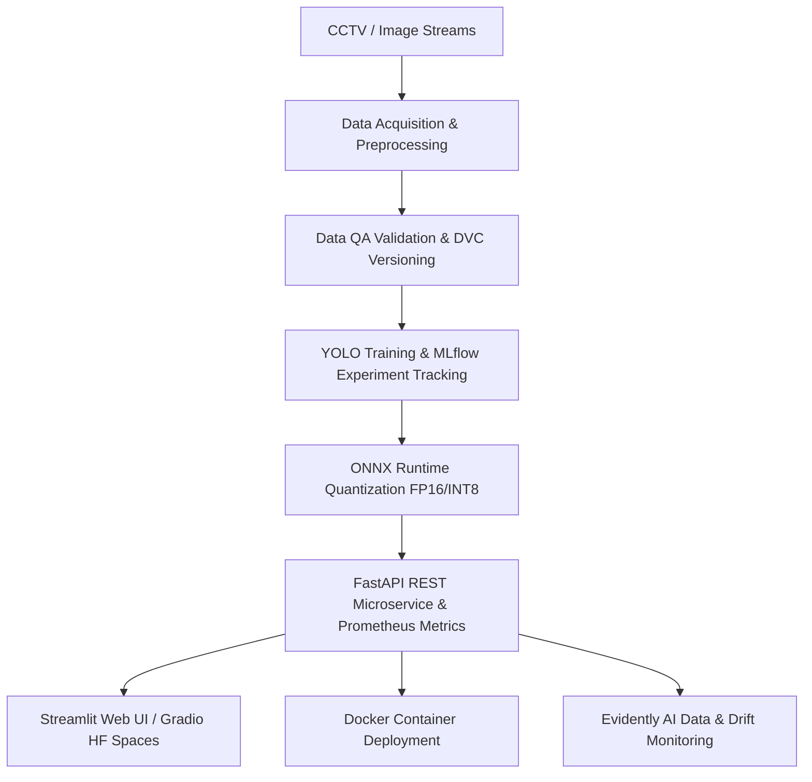

# VisionOps Guard 🛡️
> **Real-Time Industrial Safety PPE Detection & CVOps Pipeline**

[](https://github.com/rfahur11/visionops-guard)
[](https://dvc.org)
[](https://onnxruntime.ai)
[](LICENSE)

**VisionOps Guard** adalah sistem monitoring Alat Pelindung Diri (APD/PPE) dan K3 industri berbasis Computer Vision & MLOps *End-to-End*. Sistem ini mendeteksi pekerja, penggunaan helm (*hardhat*), dan rompi (*safety vest*) secara *real-time* dengan latensi rendah (<40ms), dilengkapi otomatisasi data versioning, monitoring *data drift*, dan deployment multi-platform.

---

## 🏗️ Arsitektur Sistem (System Architecture)



---

## 🛠️ Tech Stack Utama

* **Computer Vision:** PyTorch, Ultralytics YOLOv8/v11, OpenCV
* **Inference Engine:** ONNX Runtime (FP16 Quantization)
* **MLOps & Versioning:** DVC (Data Version Control), MLflow
* **Monitoring & Observability:** Evidently AI, Prometheus, Grafana
* **API & Serving:** FastAPI, Uvicorn, Streamlit, Gradio
* **CI/CD & DevOps:** GitHub Actions, Docker, Docker Compose

---

## 🚀 Quick Start (Menjalankan Lokal)

```bash
# 1. Clone Repositori
git clone https://github.com/rfahur11/visionops-guard.git
cd visionops-guard

# 2. Setup Virtual Environment & Install Dependencies
python -m venv .venv
source .venv/bin/activate  # On Windows: .\.venv\Scripts\activate
pip install -r requirements.txt

# 3. Jalankan Preprocessing Pipeline
python src/data/download_dataset.py
python src/data/data_validation.py
python src/data/preprocess.py
```

---

## 📄 Lisensi
[MIT License](LICENSE) - Dibuat untuk portofolio profesional AI Engineer & MLOps.
